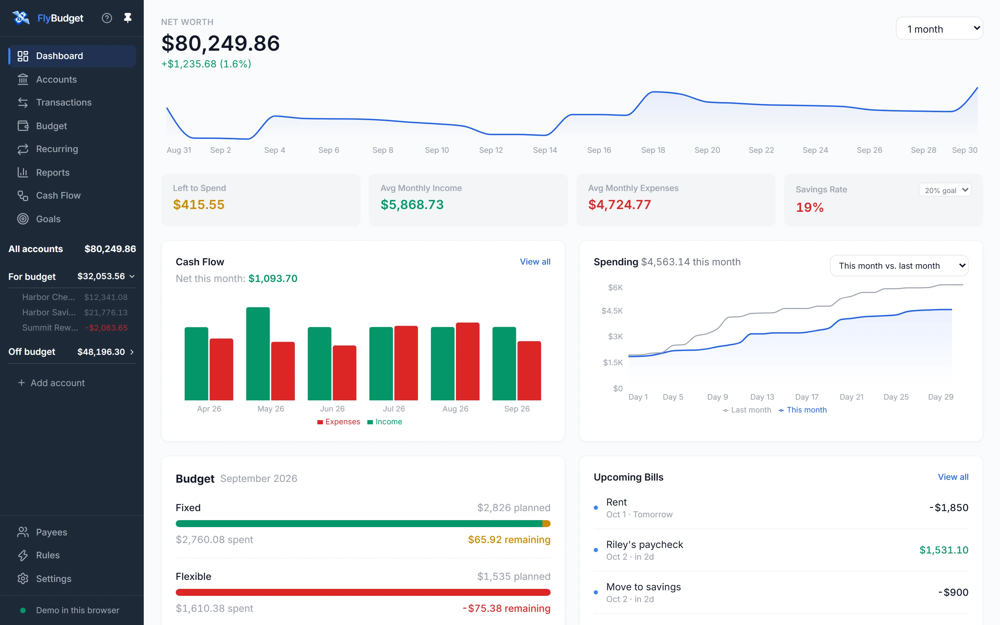
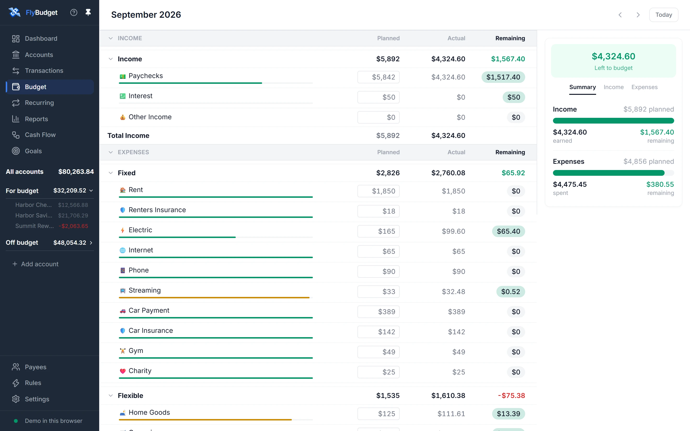
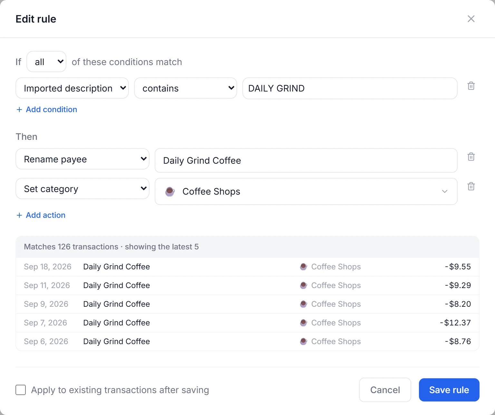
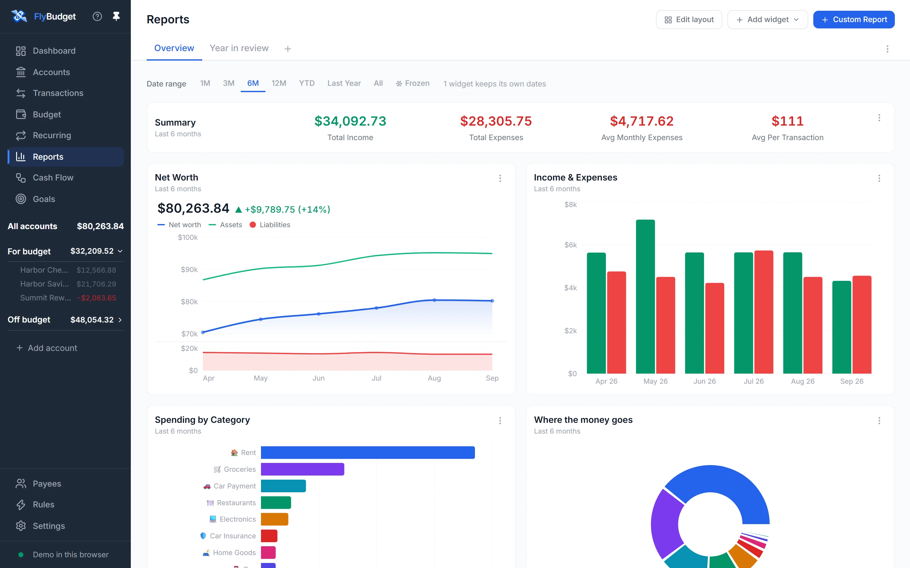
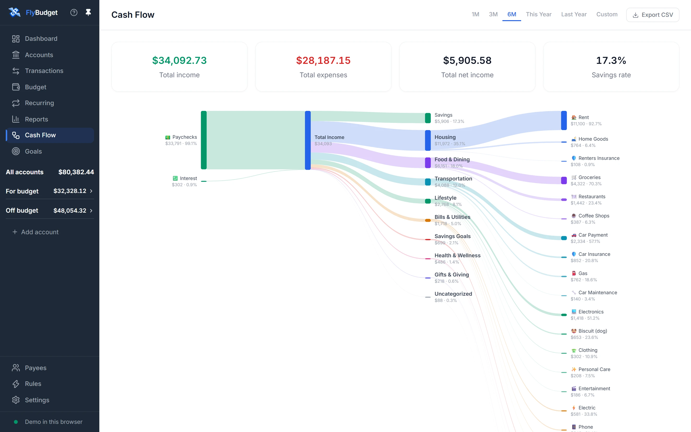
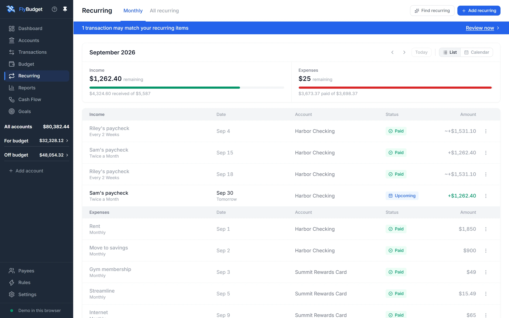
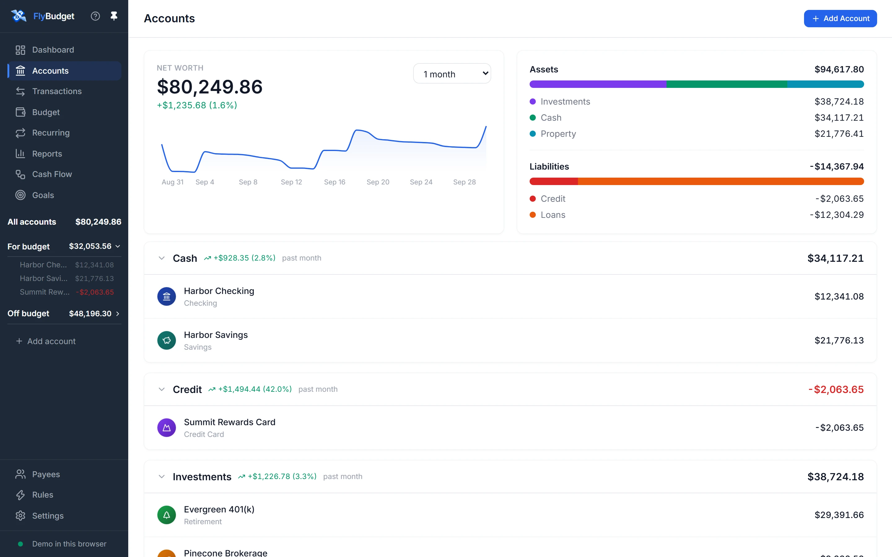
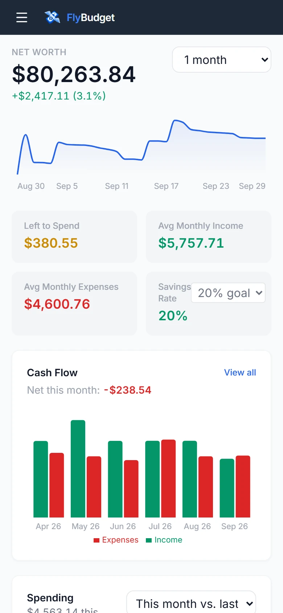
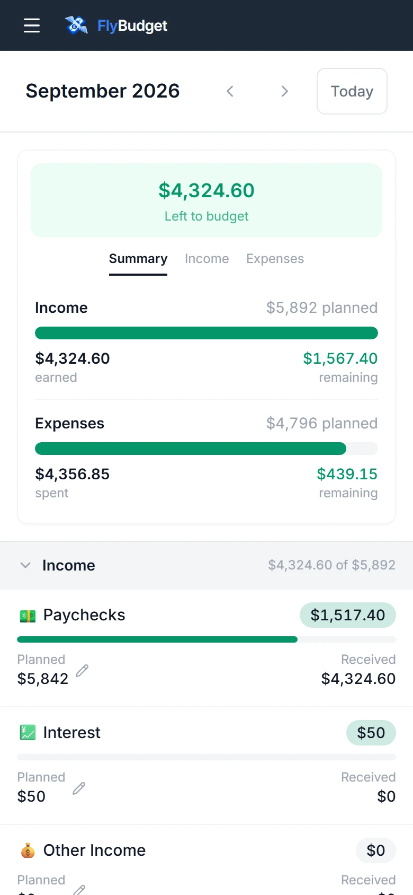
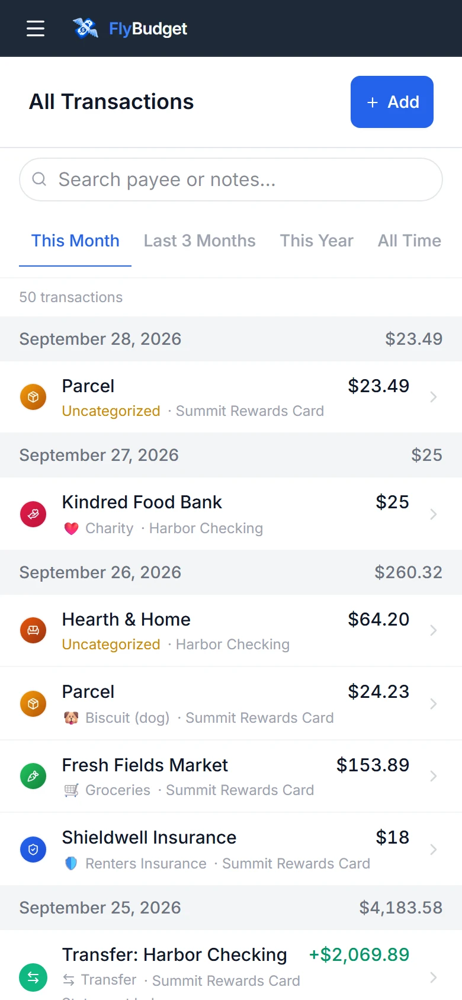

<p align="center">
  <a href="https://flybudget.org">
    
  </a>
</p>

<h1 align="center">FlyBudget</h1>

<h3 align="center">Plan your money. Keep it private.</h3>

<p align="center">
  A free, open-source budgeting app. Plan every dollar, track every account, and keep your
  financial data on your own computer or server.<br />
  <b>No subscription. No account. No tracking.</b>
</p>

<p align="center">
  <a href="https://flybudget.org/demo/"></a>
  <a href="https://flybudget.org/download"></a>
  <a href="#self-host"></a>
</p>

<p align="center">
  <a href="https://github.com/dtymoszenko/FlyBudget/actions/workflows/ci.yml"></a>
  <a href="https://github.com/dtymoszenko/FlyBudget/actions/workflows/github-code-scanning/codeql"></a>
  <a href="https://scorecard.dev/viewer/?uri=github.com/dtymoszenko/FlyBudget"></a>
  <a href="LICENSE"></a>
  <a href="https://github.com/dtymoszenko/FlyBudget/releases"></a>
  <a href="https://github.com/dtymoszenko/FlyBudget/stargazers"></a>
</p>

<p align="center">
  <a href="https://flybudget.org">Website</a> ·
  <a href="https://flybudget.org/tour/intro">Tour</a> ·
  <a href="https://flybudget.org/docs/getting-started">User guide</a> ·
  <a href="https://flybudget.org/community/security">Security</a> ·
  <a href="#roadmap">Roadmap</a> ·
  <a href="CONTRIBUTING.md">Contributing</a>
</p>

<p align="center">
  <a href="https://flybudget.org/demo/">
    <picture>
      <source media="(prefers-color-scheme: dark)" srcset="website/static/img/screenshots/dark-dashboard.webp" />
      
    </picture>
  </a>
</p>

## ✨ Why FlyBudget?

<table>
  <tr>
    <td width="30%">🔒 <b>Your data stays yours</b></td>
    <td>Everything lives in one file on your computer or your own server. There's no FlyBudget cloud, account, telemetry or crash reporting.</td>
  </tr>
  <tr>
    <td width="30%">💸 <b>Free, for good</b></td>
    <td>No subscription and no premium tier. FlyBudget is <a href="LICENSE">AGPL-3.0</a> open source, so anyone can read, check and improve the code.</td>
  </tr>
  <tr>
    <td width="30%">🧭 <b>Every dollar gets a plan</b></td>
    <td>Zero-based budgeting with carry-over, rules that sort transactions for you, recurring bills, goals and reports you arrange yourself.</td>
  </tr>
  <tr>
    <td width="30%">💻 <b>On every device you use</b></td>
    <td>A desktop app for Windows, macOS and Linux, or a self-hosted server you open from any browser, with a layout made for phones and a copy that works offline.</td>
  </tr>
  <tr>
    <td width="30%">🏦 <b>Bring your bank with you</b></td>
    <td>Import CSV files from any bank, or sync automatically with <a href="https://flybudget.org/docs/bank-sync">SimpleFIN</a> or <a href="https://flybudget.org/docs/bank-sync">Plaid</a>.</td>
  </tr>
</table>

## 🚀 Get started in a minute

**1. Try it without installing anything.** The [live demo](https://flybudget.org/demo/) runs the
real app in your browser with a sample budget. Nothing leaves your browser, and closing the tab
wipes it.

**2. Install the desktop app.**

| Platform    | Download                                                                                                                                                                                                                                                                               | Requires                   |
| ----------- | -------------------------------------------------------------------------------------------------------------------------------------------------------------------------------------------------------------------------------------------------------------------------------------- | -------------------------- |
| **Windows** | [Installer (.exe)](https://github.com/dtymoszenko/FlyBudget/releases/latest/download/FlyBudget-Windows-Setup.exe)                                                                                                                                                                      | Windows 10 or 11, 64-bit   |
| **macOS**   | [Apple silicon (.dmg)](https://github.com/dtymoszenko/FlyBudget/releases/latest/download/FlyBudget-macOS-arm64.dmg) · [Intel (.dmg)](https://github.com/dtymoszenko/FlyBudget/releases/latest/download/FlyBudget-macOS-x64.dmg)                                                        | macOS 12 Monterey or later |
| **Linux**   | [.deb](https://github.com/dtymoszenko/FlyBudget/releases/latest/download/FlyBudget-Linux-amd64.deb) · [.AppImage](https://github.com/dtymoszenko/FlyBudget/releases/latest/download/FlyBudget-Linux-x86_64.AppImage) · [ARM](https://github.com/dtymoszenko/FlyBudget/releases/latest) | 64-bit, x86 or ARM         |

The installers aren't signed with a paid Windows or Apple certificate yet, so your computer may
ask you to confirm the first time you open FlyBudget. The
[installing guide](https://flybudget.org/docs/installing) shows what to click, and every
download can be [verified](#security) against the build that made it.

**3. Follow the checklist.** A new budget opens on a short setup, and the dashboard's
_Getting started_ checklist walks you through adding accounts, importing transactions and
planning your first month. The [user guide](https://flybudget.org/docs/getting-started) covers
every feature.

<a id="self-host"></a>

### 🐳 Self-host with Docker

Run FlyBudget on your own server, protected by a password, and open it from any browser,
including your phone:

```bash
curl -O https://raw.githubusercontent.com/dtymoszenko/FlyBudget/main/docker-compose.yml
openssl rand -base64 32 > flybudget_data_key.txt   # encryption key for bank credentials
sudo chown 1000:1000 flybudget_data_key.txt && sudo chmod 400 flybudget_data_key.txt
docker compose up -d
docker logs flybudget                              # prints the one-time setup code
```

Open `http://<your-server>:3001`, enter the setup code and choose your password. Images are
published for amd64 and arm64 as `ghcr.io/dtymoszenko/flybudget`. The
[self-hosting guide](https://flybudget.org/community/self-hosting) covers HTTPS, backups and
updates.

## 📸 A look inside

<table>
  <tr>
    <td width="50%" valign="top">
      <h3>Give every dollar a job</h3>
      <p>Planned, actual and remaining for every category. Bars turn amber near the plan and red when you go over, and whatever you don't plan carries into next month.</p>
      <picture>
        <source media="(prefers-color-scheme: dark)" srcset="website/static/img/screenshots/dark-budget.webp" />
        
      </picture>
    </td>
    <td width="50%" valign="top">
      <h3>Sort transactions once</h3>
      <p>Write a rule in plain words and see which past transactions it matches as you type. Rules rename, categorize and split everything that comes in after.</p>
      <picture>
        <source media="(prefers-color-scheme: dark)" srcset="website/static/img/screenshots/dark-rule-editor.webp" />
        
      </picture>
    </td>
  </tr>
  <tr>
    <td width="50%" valign="top">
      <h3>Reports you arrange yourself</h3>
      <p>Dashboards of net worth, spending, trends and a transaction calendar, plus a custom report builder for anything else.</p>
      <picture>
        <source media="(prefers-color-scheme: dark)" srcset="website/static/img/screenshots/dark-reports.webp" />
        
      </picture>
    </td>
    <td width="50%" valign="top">
      <h3>See where it all flows</h3>
      <p>Income sources on one side, spending on the other, and what's left over in between.</p>
      <picture>
        <source media="(prefers-color-scheme: dark)" srcset="website/static/img/screenshots/dark-cash-flow.webp" />
        
      </picture>
    </td>
  </tr>
  <tr>
    <td width="50%" valign="top">
      <h3>Never miss a bill</h3>
      <p>Bills, subscriptions and paychecks for the month, as a list or a calendar. FlyBudget can even find them in your past transactions.</p>
      <picture>
        <source media="(prefers-color-scheme: dark)" srcset="website/static/img/screenshots/dark-recurring.webp" />
        
      </picture>
    </td>
    <td width="50%" valign="top">
      <h3>Every account in one place</h3>
      <p>Checking, credit cards, loans, investments, property and more, with your net worth across all of them and reconciliation when you need it.</p>
      <picture>
        <source media="(prefers-color-scheme: dark)" srcset="website/static/img/screenshots/dark-accounts.webp" />
        
      </picture>
    </td>
  </tr>
</table>

<h3 align="center">📱 Made for your phone, too</h3>

<p align="center">
  Every page has a layout for small screens, and transactions you add without a connection are
  saved as soon as it's back.
</p>

<p align="center">
  <picture>
    <source media="(prefers-color-scheme: dark)" srcset="website/static/img/screenshots/dark-phone-dashboard.webp" />
    
  </picture>
  &nbsp;&nbsp;
  <picture>
    <source media="(prefers-color-scheme: dark)" srcset="website/static/img/screenshots/dark-phone-budget.webp" />
    
  </picture>
  &nbsp;&nbsp;
  <picture>
    <source media="(prefers-color-scheme: dark)" srcset="website/static/img/screenshots/dark-phone-transactions.webp" />
    
  </picture>
</p>

<p align="center">
  <a href="https://flybudget.org/tour/intro"><b>Take the full tour →</b></a>
</p>

## 🧰 Everything included

- **Budgeting:** zero-based planning by category, carry-over between months, and each
  category's history
- **Accounts:** 17 account types across cash, credit, investments, property and loans, with
  net worth, reconciliation and value updates
- **Transactions:** splits, transfers, search and filters, CSV import with duplicate
  detection, and bank sync through SimpleFIN or Plaid
- **Rules:** conditions on payee, amount, date, account and more; actions that rename,
  categorize, add notes or split; run them on past transactions with a preview
- **Recurring:** bills and paychecks by month or calendar, automatic detection, and
  transactions created for you
- **Reports:** dashboards with movable widgets, a custom report builder, cash flow and a
  transaction calendar
- **Goals** for savings targets, **payees** with logos and default categories, and
  **backups** you can restore in one step
- **Light and dark themes**, and a phone layout for every page

<a id="security"></a>

## 🛡️ Security you can check

A budgeting app holds some of the most personal data you have, so FlyBudget treats security
as a feature, not an afterthought:

- ✅ **Local-first.** No FlyBudget servers, accounts, telemetry or crash reports. Your data only
  leaves your machine when bank sync talks to Plaid or SimpleFIN for you.
- ✅ **Encrypted bank credentials.** Plaid and SimpleFIN secrets are stored with AES-256-GCM,
  under a key protected by your operating system (Windows DPAPI, macOS Keychain, Linux secret
  service). A copied database gives no bank access.
- ✅ **A locked-down app.** The built-in API answers only the app's own window, with a new secret
  every launch; other websites and programs are turned away. The window is sandboxed under a
  strict Content Security Policy.
- ✅ **A hardened server.** Self-hosted installs use a scrypt-hashed password, a one-time setup
  code, rate-limited sign-in, signed-in device management and a read-only, unprivileged
  container.
- ✅ **Verifiable releases.** Every download and Docker image comes with signed build provenance
  from GitHub Actions. Check that a file was built from this repository:

  ```bash
  gh attestation verify FlyBudget-Windows-Setup.exe -R dtymoszenko/FlyBudget
  ```

- ✅ **A careful supply chain.** Dependency install scripts never run, npm registry signatures
  are checked in CI, and new dependency versions wait a week before they're proposed.

Read the full model in [SECURITY.md](SECURITY.md) or on the
[security page](https://flybudget.org/community/security). Found a problem? Please
[report it privately](https://github.com/dtymoszenko/FlyBudget/security/advisories/new).

## 💙 Built with care

- **Tested on every change:** property-based tests check the budget math, rules engine and
  recurrence dates against hundreds of generated cases, and Playwright end-to-end tests drive
  the desktop app, the self-hosted server, a phone-sized screen and the demo.
- **Never locks you out:** if the server drops, FlyBudget keeps showing your budget, queues new
  transactions and reconnects on its own.
- **Your data is portable:** download a full backup or CSV export whenever you like.
- **Documented:** a [user guide](https://flybudget.org/docs/getting-started) for every feature,
  a [tour](https://flybudget.org/tour/intro) of every page and an
  [FAQ](https://flybudget.org/docs/faq).

<details>
<summary><b>🛠️ Run it from source</b></summary>

<br />

You'll need Node.js and npm.

```bash
git clone https://github.com/dtymoszenko/FlyBudget.git
cd FlyBudget
npm ci && npm ci --prefix client && npm ci --prefix server
npm run dev          # opens on http://localhost:5173
npm run electron:dev # or run it as the desktop app
```

Built with React 19, Vite, Tailwind CSS, TanStack Query, Express 5, SQLite (Drizzle ORM) and
Electron. See [CONTRIBUTING.md](CONTRIBUTING.md) for the checks to run before a pull request.

</details>

<a id="roadmap"></a>

## 🗺️ Roadmap

Ideas we're considering (not promises):

- Imports from YNAB and other budgeting apps
- Investment projections and forecasting, and a FIRE calculator
- Envelope budgeting
- Syncing one budget between devices that also work offline
- MCP support

Have an idea? [Open an issue](https://github.com/dtymoszenko/FlyBudget/issues).

## 🤝 Contributing

Contributions are welcome, from bug reports to pull requests. See
[CONTRIBUTING.md](CONTRIBUTING.md) for setup, the checks to run and commit conventions. Before
your first pull request is merged, you'll be asked to accept the
[Contributor License Agreement](CLA.md) with a one-line comment.

## 📄 License

FlyBudget is free software under the [GNU Affero General Public License v3.0](LICENSE)
(AGPL-3.0-only). You can use, study, share and modify it. If you run a modified version for
other people over a network, you must share your source code with them too.

<p align="center">
  <br />
  If FlyBudget helps you, a ⭐ helps other people find it.
</p>
